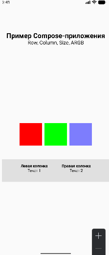

# Лабораторная работа №5. 

## Краткое описание приложения
Приложение демонстрирует базовые возможности Jetpack Compose:
- Использование контейнеров Row и Column для размещения элементов
- Работу с ARGB-моделью цветов (прозрачные и непрозрачные блоки)
- Комбинирование контейнеров для создания сложных макетов
- Использование Scaffold для создания экрана с верхней панелью и плавающей кнопкой

## Скриншот результата
